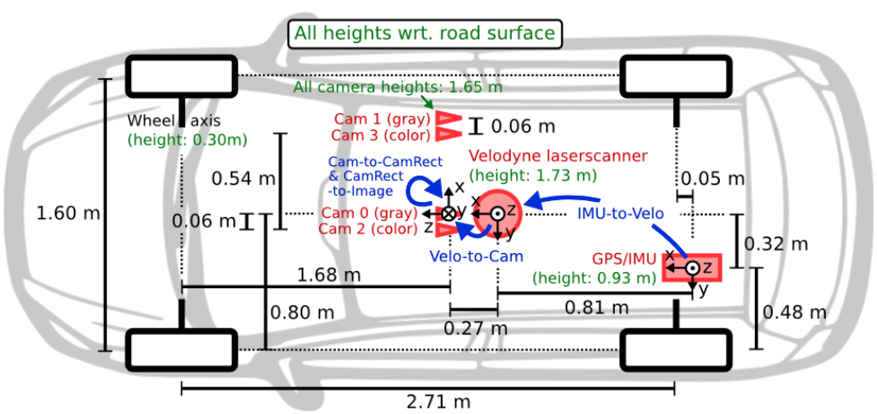
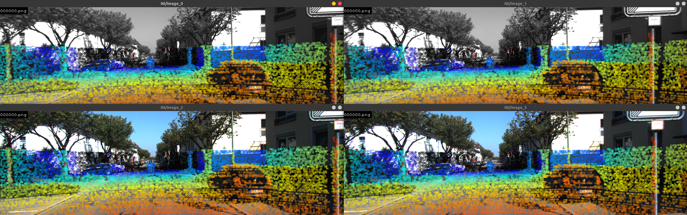
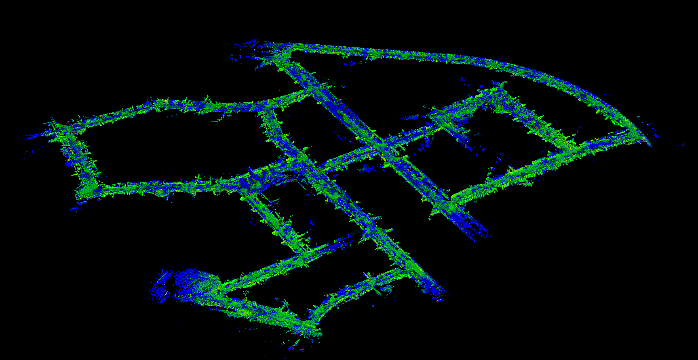
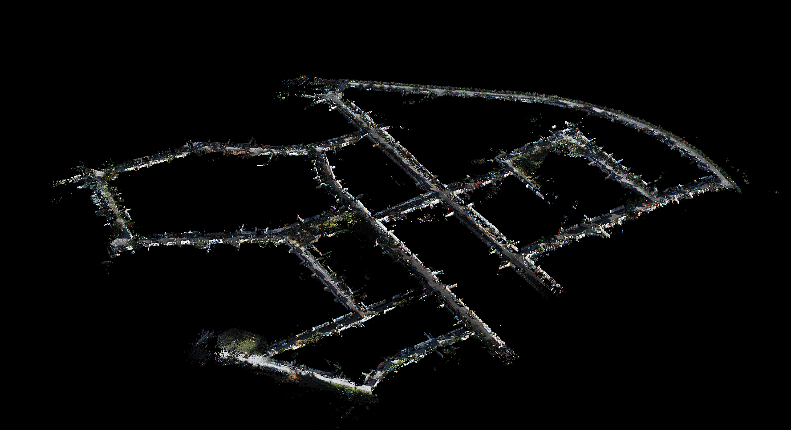
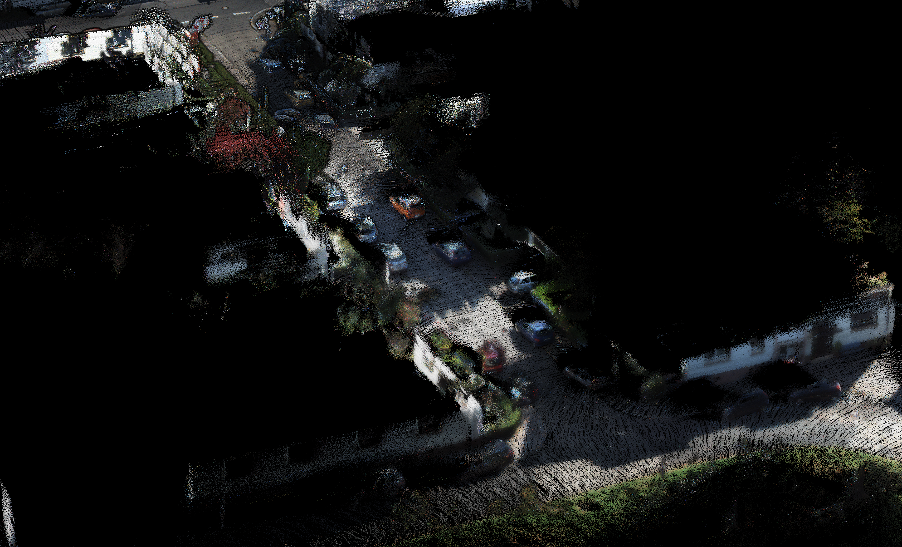

# KITTI_odometry

* KITTI data set 핸들링 tools (for odometry)
- LiDAR to Img projection view
- Make color map

* KITTI Car 구조


* KITTI data set 구조 
```
KITTI
├── data_odometry_velodyne
│   └── dataset
│       └── sequences
│           └── 00 ~ 21
│               └── label
│               └── velodyne
│                   └── .bin
│
├── data_odometry_poses
│   └── dataset
│       └── poses
│          └── 00~10.txt
│
├── data_odometry_gray
│   └── dataset
│       └── sequences
│           └── 00 ~ 21
│               └── image0
│               └── image1
│                   └── .png
│
├── data_odometry_color
│   └── dataset
│       └── sequences
│           └── 00 ~ 21
│               └── image2
│               └── image3
│                   └── .png
│
├── data_odometry_calib
│   └── dataset
│       └── sequences
│           └── 00 ~ 21
│               └── calib.txt
│               └── times.txt
└──
```


# How to build
```
git clone https://gitlab.mobiltech.io/mgkim/kitti_odometry
mkdir build
cd build
cmake ..
make -j4
```


# How to use
```
./kittiOdometry '/home/mobiltech/Desktop/Data-ssd/kitti'

 - n, m : 이전, 다음 이미지
 - s : map 저장
 - Esc : 나가기
```
# Result
* 00_image_projection


* 00_intensity_map


* 00_color_map


* 00_color_part
